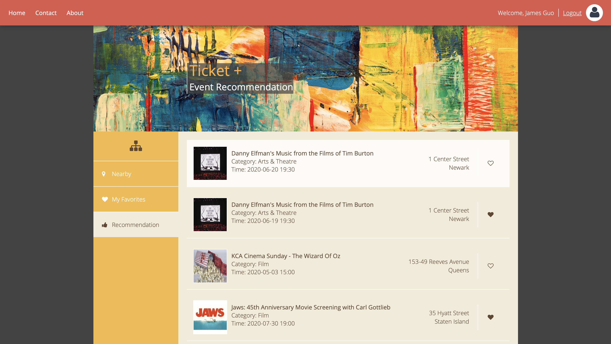

# Ticket+
 > A web application for users to search for events based on geolocation and purchase tickets.



## Table of contents
* [General Info](#general-info)
* [DEMO](#demo)
* [Built With](#built-with)
* [Getting Started](#getting-started)
* [Deployment](#deployment)
* [Features](#features)
* [Contact](#contact)

## General Info
- Designed an interactive web page (HTML, CSS, JavaScript, AJAX) for users to search for events and purchase tickets.
- Created Java servlets with RESTful APIs to handle HTTP requests and responses.
- Used MySQL to store real business data and migrated to NoSQL database (MongoDB) for better scalability
- Designed algorithms (e.g., content-based recommendation) to improve personalized business recommendations based on search history and favorite records.
- Designed an information retrieval subsystem that exploits user-provided relevance feedback based on Rocchio’s query expansion algorithm to improve the search results
- Deployed to AmazonEC2 to handle 150 QPS (tested by Apache JMeter).

## DEMO
http:/ticket.yuxuan.site
- username: demo
- password: 123456

## Built With
* Frontend
  - HTML, CSS, JavaScript, AJAX
  - jQuery - 3.3.1
  - Bootstrap fontawsome - 4.5.0
  - md5
* Backend
  * Java - 13.0.1
  * Apache Tomcat - 9.0.33
  * MySQL - 5.7
  * MongoDB - 3.2.19
  * java-json, bson - 3.10.2
* Testing
  * Postman - 7.21.1
  * Apache JMeter - 5.2
  * JUnit, jsonassert - 1.5.0
* Deployment
  * Amazon EC2

## Getting Started
These instructions will get you a copy of the project up and running on your local machine for development and testing purposes. See deployment for notes on how to deploy the project on a live system.
#### Prerequisites
- Java
<br> Java 8 or higher version should be fine.
<br> For others: https://java.com/en/download/help/download_options.xml
<br> For Linux:
> sudo add-apt-repository ppa:linuxuprising/java
<br> sudo apt update
<br> sudo apt-get install oracle-java13-installer

- Apache Tomcat
<br> if you have Java EE IDE like Eclipse for Java EE you can skip this and add the Tomcat server and start it in Ecipse.
<br> For others: https://tomcat.apache.org/tomcat-9.0-doc/setup.html#Introduction
<br> For Linux:
> cd /opt/
<br> sudo wget http://mirrors.ocf.berkeley.edu/apache/tomcat/tomcat-9/v9.0.33/bin/apache-tomcat-9.0.33.tar.gz
<br> sudo tar xzf apache-tomcat-9.0.33.tar.gz
<br> sudo ln -s apache-tomcat-9.0.33 tomcat
<br> echo "export CATALINA_HOME=\"/opt/tomcat\"" >> ~/.bashrc
<br> source ~/.bashrc
<br> cd /opt/tomcat
<br> sudo bin/startup.sh

- MySQL
<br> install, change the root account password, and start MySQL server.
<br> For others:
https://dev.mysql.com/doc/mysql-installation-excerpt/5.7/en/
<br> For Linux:
> sudo apt-get install mysql-server
<br> sudo service mysql stop
<br> sudo /usr/sbin/mysqld --skip-grant-tables --skip-networking &
<br> mysql -u root
<br> FLUSH PRIVILEGES;
<br> USE mysql;
<br> UPDATE user SET authentication_string=PASSWORD("root") WHERE User='root';
<br> UPDATE user SET authentication_string=PASSWORD("root") WHERE User='root';
<br> sudo pkill mysqld
<br> sudo service mysql start

- MongoDB
<br> Optional, the default database is MySQL, which can be changed in `src/db/DBConnectionFactory.java`
> https://docs.mongodb.com/manual/administration/install-community/

#### Installing
- Clone the project to your local computer and import to IDE (Eclipse for Java EE recommended).
- Change the database connection configuration in `src/db/mysql/MySQLDBUtil.java`
- Optional, change the server port number in `server.xml`
- Start the Tomcat Server and visit http://localhost:8080/Ticket.

#### Running the Test
- Create tables and insert some initial data into the database. Run `src/db/mysql/MySQLTableCreation.java` as Java application (`src/db/mongodb/MongoDBCreation.java` for MongoDB).
Or excute following command in the MySQL console:
``` sql
DROP DATABASE IF EXISTS ticket;
CREATE DATABASE ticket;
USE ticket;
CREATE TABLE items (
    item_id VARCHAR(255) NOT NULL,
    name VARCHAR(255),
    rating FLOAT,
    address VARCHAR(255),
    image_url VARCHAR(255),
    url VARCHAR(255),
    distance FLOAT,
    date VARCHAR(255),
    local_time VARCHAR(255),
    PRIMARY KEY (item_id)
);  
CREATE TABLE categories (
    item_id VARCHAR(255) NOT NULL,
    category VARCHAR(255) NOT NULL,
    PRIMARY KEY ( item_id, category),
    FOREIGN KEY (item_id) REFERENCES items(item_id)
);
CREATE TABLE users (
    user_id VARCHAR(255) NOT NULL,
    password VARCHAR(255) NOT NULL,
    first_name VARCHAR(255),
    last_name VARCHAR(255),
    PRIMARY KEY (user_id)
);
CREATE TABLE history (
    user_id VARCHAR(255) NOT NULL,
    item_id VARCHAR(255) NOT NULL,
    last_favor_time timestamp NOT NULL DEFAULT    CURRENT_TIMESTAMP,
    PRIMARY KEY (user_id, item_id),
    FOREIGN KEY (item_id) REFERENCES items(item_id),
    FOREIGN KEY (user_id) REFERENCES users(user_id)
);
INSERT INTO users VALUES (
  "demo", "67540ee3374a6402d2a2394ab0154a8f", "James", "Guo"
);
```

- A testing account should be created:
  - username: demo
  - password: 123456

- Remember to restart the server in case any changes are made to the code.

## Deployment
Additional notes about how to deploy this on a live system.
- Install Java, MySQL and Tomcat
- Copy Ticket.war file and upload to the `/tomcat/webapps` directory on the server.
- Verify the server on your browser: http://IP_ADD:PORT_NUM/Ticket.


### Features
List of features ready and TODOs for future development
* Search nearby events based on geolocation using TicketMaster API.
* User management with user's full name, md5-encrypted password, and users' favorite events stored.
* Personlized business recommendation based on users' search history and favorite events.
* Migrate from MySQL to MongoDB to improve the scalability.

To-do list:
* Autocomplete search bar
* Add more recommendation algorithms


### Contact
Created by [@nflsgyx](https://github.com/nflsgyx) - feel free to contact me!
